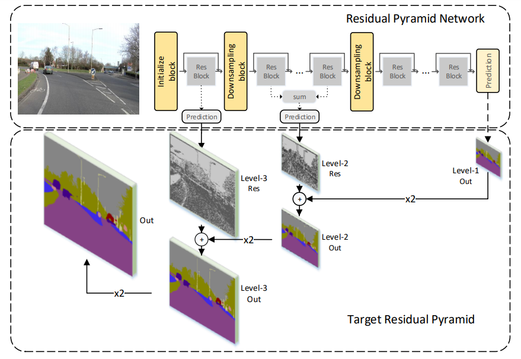
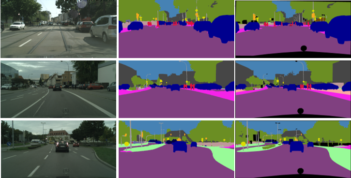

# PyTorch-RPNet

PyTorch implementation of [*Residual Pyramid Learning for Single-Shot Semantic Segmentation*](https://arxiv.org/abs/1903.09746)

### Network


### Segmentation Result
<h1 align="center">
  <br/>
</h1>

### Citing RPNet

Please cite RPNet in your publications if it helps your research:

    @article{DBLP:journals/corr/abs-1903-09746,
      author    = {Xiaoyu Chen and
                   Xiaotian Lou and
                   Lianfa Bai and
                   Jing Han},
      title     = {Residual Pyramid Learning for Single-Shot Semantic Segmentation},
      journal   = {CoRR},
      volume    = {abs/1903.09746},
      year      = {2019},
      url       = {http://arxiv.org/abs/1903.09746},
      archivePrefix = {arXiv},
      eprint    = {1903.09746},
      timestamp = {Mon, 01 Apr 2019 14:07:37 +0200},
      biburl    = {https://dblp.org/rec/bib/journals/corr/abs-1903-09746},
      bibsource = {dblp computer science bibliography, https://dblp.org}
    }


This implementation has been tested on the Cityscapes and CamVid (TBD) datasets. Currently, a pre-trained version of the model trained in CamVid and Cityscapes is available [here](https://github.com/superlxt/RPnet-Pytorch/tree/master/save).


|                                Dataset                               | Classes <sup>1</sup> | Input resolution | Batch size |    Epochs  |    Mean IoU (%)   |
|:--------------------------------------------------------------------:|:--------------------:|:----------------:|:----------:|:----------:|:-----------------:|
| [CamVid](http://mi.eng.cam.ac.uk/research/projects/VideoRec/CamVid/) |          11          |      480x360     |      3     |   300 x 4  |       64.82       |
|           [Cityscapes](https://www.cityscapes-dataset.com/)          |          19          |     1024x512     |      3     |   300 x 4  |     70.4 (val)    |

* When referring to the number of classes, the void/unlabeled class is always excluded.<br/>
* Just for reference since changes in implementation, datasets, and hardware can lead to very different results. Reference hardware: Nvidia GTX 1080ti and an Intel Core i7-7920x 2.9GHz. 


The results on Cityscapes dataset


|      Method      |   Input Size   |   Mean IoU   |   Mean iIoU   |    fps   |    FLOPs   |
|:----------------:|:--------------:|:------------:|:-------------:|:--------:|:----------:|
|       ENet       |    1024*512    |     58.3     |      34.4     |    77    |    4.03B   |
|      ERFNet      |    1024*512    |     68.0     |      40.4     |    59    |    25.6B   |
|      ESPNet      |    1024*512    |     60.3     |      31.8     |    139   |    3.19B   |
|      BiSeNet     |    1036*768    |     68.4     |       -       |    69    |    26.4B   |
|       ICNet      |    2048*1024   |     69.5     |       -       |    30    |      -     |
|DeepLab(Mobilenet)|    2048*1024   |  70.71(val)  |       -       |    16    |    21.3B   |
|       LRR        |    2048*1024   |     69.7     |      48.0     |    2     |      -     |
|     REfinNet     |    2048*1024   |     73.6     |      47.2     |    -     |     263B   |
| **RPNet(ENet)**  |    1024*512    |     63.37    |      39.0     |    88    |    4.28B   |
| **RPNet(ERFNet)**|    1024*512    |     67.9     |      44.9     |    123   |    20.7B   |


## Installation

1. Python 3 and pip.
2. Set up a virtual environment (optional, but recommended).
3. Install dependencies using pip: ``pip install -r requirements.txt``.


### Examples: Training

```
sh train.sh
```

### Examples: Testing

```
python main.py -m test --step 1
```

